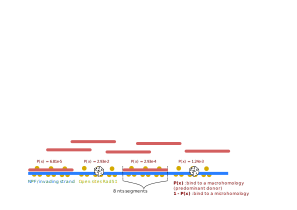
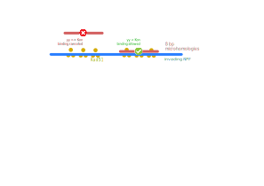
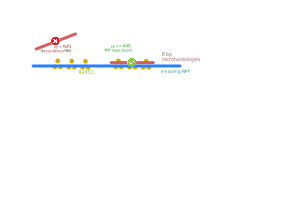
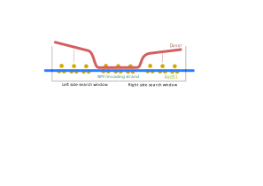
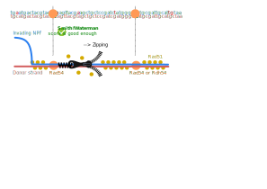
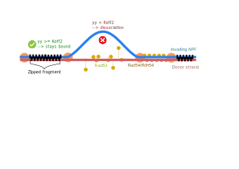
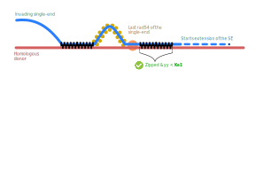
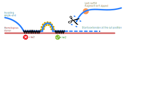

### Project : Double Strand Break (DSB) homologous recombination (HR) simulation 

Homologous recombination is a conserved DNA break repair pathway that uniquely uses an intact DNA molecule as a template. The search for this homologous template is carried out by a specializedand conserved nucleoprotein filament (NPF) assembled on the DNA flanking the break.

The goal of this project is to develop and perform a computational  stochastic model for analyzing biological results by easily modifying search parameters. Since homology sampling by the NPF binds at 8 nts microhomology, we defined their positions genome-wide for a given NPF sequence, on average 370 per position in the NPF. The simulation thus has a probability of association and dissociation with anypossible microhomology, one being present at a long homologous donor and the others dispersed genome-wide. Association to a microhomology, by virtue of physically tethering the NPF to a given dsDNA molecule, increases the probability of engaging a nearby homology, which plays in favor of the long homology, provided that the dissociation constant is sufficiently high. This model enables us to differentiate from an effect of homology length and association/dissociation from micro-homologies.

